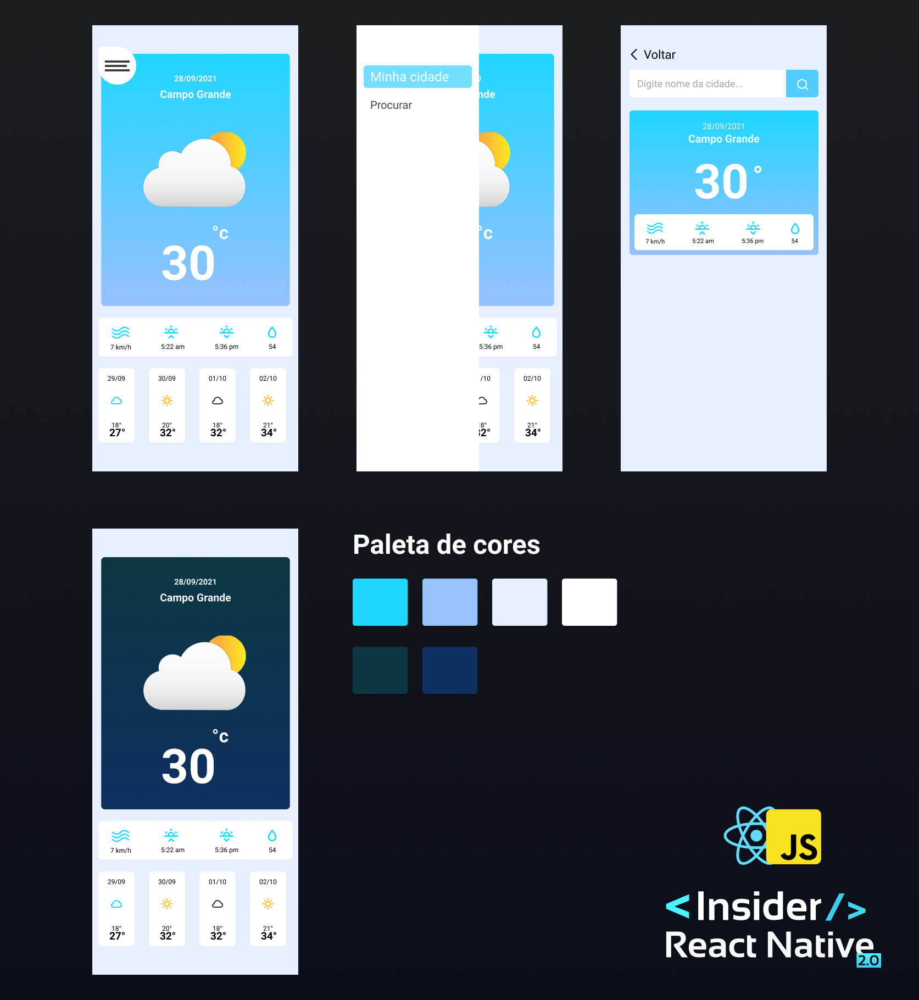

# Aplicativo para pesquisa de dados metereológicos em React Native com Expo

Projeto desenvolvido na semana "React native Insider 2" do canal do youtube do [Sujeito Programador](https://www.youtube.com/c/Sujeitoprogramador/)



## Para que serve

Este app tem como finalidade de informar os dados de clima e previsões do tempo. Utlizando a API do site [Hgbrasil](https://hgbrasil.com/ ) na versão free. Esta versão permite busca até 10 cidades por dia.

### Tecnologias e versões

- React Native
- NodeJs v14.16v0
- Expo  v4.3.0

### Outros recursos

- [Figma Layout](https://www.figma.com/file/2CEqVyn4KRy85f9N0Vc1VY/Projeto-App?node-id=210%3A14)

### Para executar

Via Expo
```
expo start
```
Via yarn

```
yarn start
```

## Licença

MIT License

